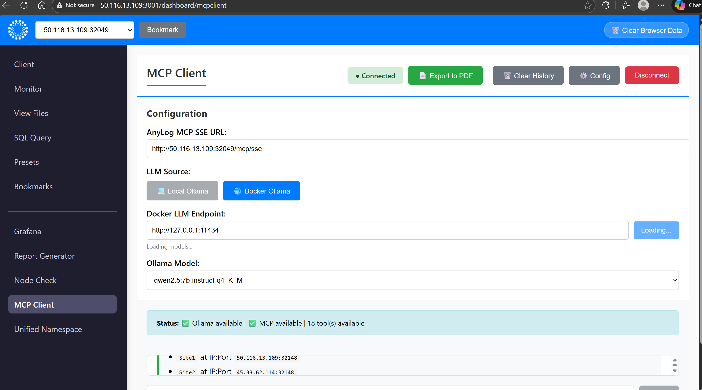

# Ollama

Ollama is a lightweight open-source framework for running language models locally.

AnyLog / EdgeLake use it as the tested model framework for the [Remote-GUI](https://github.com/AnyLog-co/Remote-GUI).

> **Note:** Ollama is a standalone service and is not managed by the support `Makefile`. Deploy and manage it directly using the commands below.

---

## Directory Structure

```
support/
└── ollama/
    ├── docker-compose.yaml        # CPU-only deployment
    └── docker-compose-gpu.yaml    # NVIDIA GPU deployment
```

---

## Install

### Docker

**1. Deploy Ollama**

```shell
# CPU only
docker compose -f support/ollama/docker-compose.yaml up -d

# NVIDIA GPU
docker compose -f support/ollama/docker-compose-gpu.yaml up -d
```

The compose files automatically pull `qwen2.5:7b-instruct` on first start. To pull a different [model](https://ollama.com/search) manually (model must support MCP function calling):

```shell
docker exec -it ollama ollama pull <model-name>
```

**2. Verify the model is installed**

```shell
curl http://localhost:11434/api/tags
```

#### NVIDIA GPU support

Before using the GPU compose file, install the NVIDIA Container Toolkit:

```shell
sudo apt update
sudo apt install -y nvidia-container-toolkit
sudo systemctl restart docker
```

Test that Docker can see the GPU:

```shell
docker run --rm --gpus all nvidia/cuda:12.2.0-base nvidia-smi
```

---

### Mac (Apple Silicon)

Apple M-series chips have an integrated GPU that Ollama uses automatically, but it is not accessible from within Docker — install Ollama natively via Homebrew instead.

**1. Install**

```shell
brew install ollama
```

**2. Start the server**

```shell
export OLLAMA_HOST=0.0.0.0:11434
ollama serve
```

**3. Pull the model** (M1/M2/M3 Macs use the integrated GPU and Apple Neural Engine automatically)

```shell
ollama pull qwen2.5:7b-instruct
```

**4. Verify**

```shell
curl http://localhost:11434/api/tags
```

---

## Configure in Remote-GUI

1. Deploy Remote-GUI (see the main [README](../README.md))
2. Open the Remote-GUI in your browser and navigate to **MCP Client**
3. Click **Config** and update the Ollama connection:
   - **LLM Source:** `Docker Ollama` (or `Local Ollama` if running natively on Mac)
   - **Docker LLM Endpoint:** `http://<host-ip>:11434`
   - **Ollama Model:** select your pulled model from the dropdown
4. Click **Loading** to confirm the connection — status should show `Ollama available`

